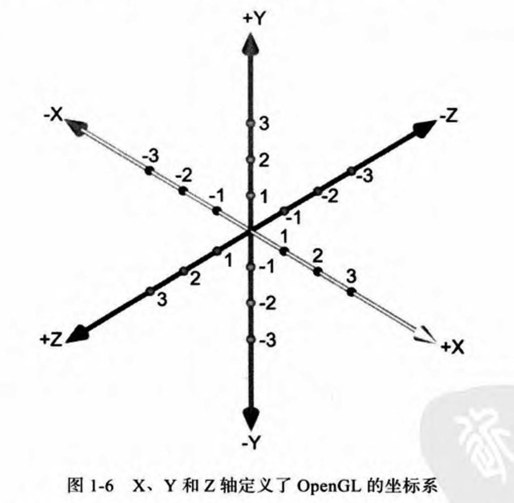

# XXOpenGLES
### 一. openGL01
#### 1. 缓存生成的7个步骤:
 1. 生成(Generate)->`glGenBuffers`    
 2. 绑定(Bind)->`glBindBuffer`
 3. 缓存数据(Buffer Data)->`glBufferData`  
 4. 启动或禁止(Enable or Disable)->`glEnableVertexAttribArray`
 5. 设置指针(Set Pointers)->`glVertexAttribPointer`
 6. 绘图(Draw)->`glDrawArrays`
 7. 删除(Delete)->`glDeleteBuffers`

#### 2. 坐标系:
想象成一个正方体的左下角的那个顶点

#### 3. 一些封装的GLKit
 1. **GLKView** : 简化了通过用CoreAnimation层来自动创建并管理帧缓存何渲染缓存共享内存所需要做的工作.
 2. **GLKBaseEffect** : GLKit的另一个内建类,简化OpenGL ES的很多常用操作。GLKBaseEffect隐藏了iOS设备的多个OpenGLES版本之间的差异。
 3. **vertexBufferID** : 保存了用于盛放本例中用到的顶点数据的缓存的OpenGL ES标识符